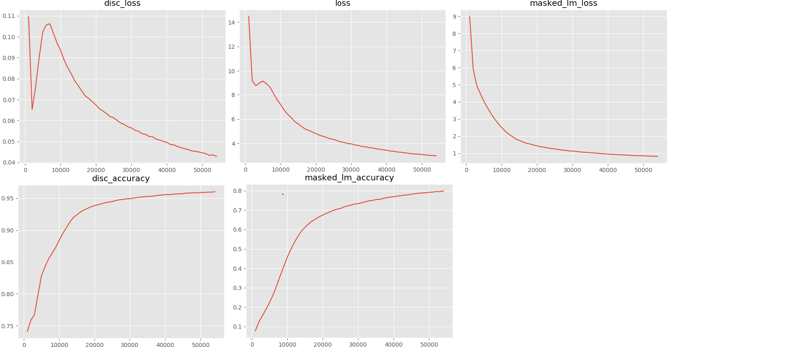

## electra_pytorch

This repository contains a PyTorch implementation of the electra model from the paper 

[ELECTRA: Pre-training Text Encoders as Discriminators Rather Than Generators ](https://openreview.net/pdf?id=r1xMH1BtvB)

by Kevin Clark. Minh-Thang Luong. Quoc V. Le. Christopher D. Manning

**NOTE**： 🤗This version is experience version,and the offical PyTorch version is waiting for the update of 🤗[huggingface](https://github.com/huggingface/transformers)

**NOTE**: 2020-04-08 ELECTRA is now available in PyTorch through the HuggingFace Transformers library!  https://github.com/huggingface/transformers/releases/tag/v2.8.0


## Dependencies

- pytorch=1.10+
- cuda=9.0
- cudnn=7.5
- scikit-learn
- sentencepiece
- python3.6+

## Download Pre-trained Models 

**English**: Official download links: [google electra](https://github.com/google-research/electra)

**Chinese**: 

* https://github.com/CLUEbenchmark/ELECTRA
* https://github.com/ymcui/Chinese-ELECTRA

## Fine-tuning

１. Place `config.json` into the `prev_trained_model/electra_base` directory.
example:
```text
├── prev_trained_model
|  └── electra_base
|  |  └── pytorch_model.bin
|  |  └── config.json
|  |  └── vocab.txt
```

2．convert electra tf checkpoint to pytorch
```python
python convert_electra_tf_checkpoint_to_pytorch.py \
    --tf_checkpoint_path=./prev_trained_model/electra_large \
    --electra_config_file=./prev_trained_model/electra_large/config.json \
    --pytorch_dump_path=./prev_trained_model/electra_large/pytorch_model.bin
```

Before running anyone of these GLUE/CLUE tasks you should download the [GLUE data](https://gluebenchmark.com/tasks) /[CLUE data](https://www.cluebenchmarks.com/introduce.html) by running  script named `download_xxxx_data` in the directory`tools` and unpack it to some directory $DATA_DIR.

3．run `sh scripts/run_classifier_sst2.sh`to fine tuning albert model

## Result

Performance of **electra** on `GLUE` benchmark results using a single-model setup on **dev**:

|  | Cola| Sst-2| Mnli| Sts-b|
| :------- | :---------: | :---------: |:---------: | :---------: |
| metrics | matthews_corrcoef | accuracy | accuracy | pearson |
| electra_small | 56.6 | 90.5 |  | 87.6 |
| electra_base | 67.8 | 94.2 |  | 91.1 |
| electra_large | 71.1 | 95.8 |  | 92.4 |

Performance of **electra** on `CLUE` benchmark results using a single-model setup on **dev**:

|  | AFQMC| TNEWS | IFLYTEK |
| :------- | :---------: | :---------: |:---------: |
| metrics | accuracy | accuracy | accuracy |
| electra_tiny | 69.82 | 54.48 | 56.98 |

Performance of **electra** on `lcqmc and chnsenticorp` results using a single-model setup on **dev**:

|  | chnsenticorp |
| :------- | :---------: |
| metrics | accuracy |
| electra_small |  92.75 |
| electra_base | 94.08 |

## pretraining

Small model on small dataset.


